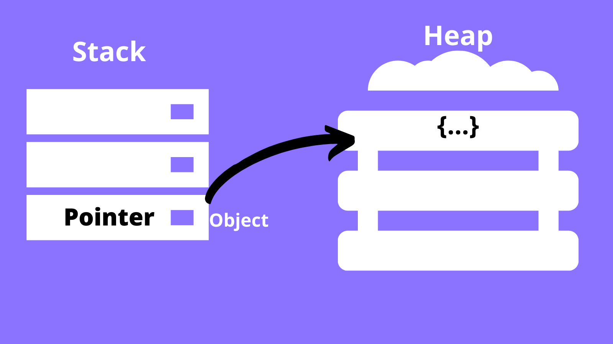
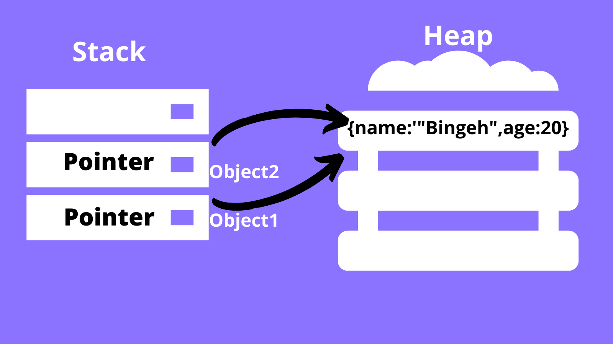

### Understanding Syntax and Code Structure in JavaScript [Understanding Syntax and Code Structure](https://www.digitalocean.com/community/tutorials/understanding-syntax-and-code-structure-in-javascript)
## What is a syntax?
- Answer: <b>Syntax</b> is a <i>set of rules </i> that determine(identify) <i> the correct structure </i> of programming languages.
## Two main reasons to focus on syntax?
- Answer:  <b>Readability </b> and <b> functionality </b> are the vital reasons to focus on syntax.
## Does JS ignore the whitespaces?
- Excessive whitespace <b> outside of a string</b> and the spaces between operators and other symbols are <b> ignored </b> by JavaScript.
## Where should we use indentation?
-  For a readability  we use newlines and indentation.
## In which ways we use indentation?
- any code included within a block;
- if/else statement;
```
// Conditional statement with indentation
if (x === 1) {
	// execute code if true
} else {
	// execute code if false
}
```
- nested block statement:
```
function isEqualToOne(x) {
	// Check if x is equal to one
	if (x === 1) {
		// on success, return true
		return true;
	} else {
	  return false;
	}
}
```
## What is identifier?
- Answer: The <b> name of a variable,function or property </b> is called  <b>identifier</b> Note: Identifiers consist of letters and numbers,however they cannot include any symbol oustide of $ and _.Additionally, identifiers cannot start with a number!!!
## Are identifiers case-sensitive?
- Yes,they are. For instance,let myVariable = 1; let myvariable = 2; would refer to 2 distinct variables. A common way to write an identifier in JS is Camel Case. There is only exception in writing class identifiers using PascalCase.
## Can we use Reserved Keywords as identifiers? [A list of reserved keywords](https://developer.mozilla.org/en-US/docs/Web/JavaScript/Reference/Lexical_grammar#reserved_keywords_as_of_ecmascript_2015)
- Identfiers also <b>Must not consist </b> of any reserved keywords. <b>Keywords  </b> are words in JS that have a built-in functionality, such as var,if,for and this. For example it is a mistake to assign a value to a variable named var: var var = 'Some value";

## Question 1: Which of these expressions will give an error: let a=5; let a= 5?
- Answer: No one.Because the spaces between operators and other symbols are ignored by JS. The exception is a whitespace inside of a string!

## Question2:  All programming languages including JS use special symbols. How V8Engine are analysing () and {}? How does it understand them during the translation?
- I don't know the answer yet!!! But i will!!

## Question3: Are there any difference between let StudentName; let studentName; let studentname?Is JS case-sensitive?
- JS is a case-sensitive. These three identifiers are three distinct variables.

## Question4: In which ways we use indentation? Am i obligatory to use indendation?
- any code included within a block;
- if/else statement;
```
// Conditional statement with indentation
if (x === 1) {
	// execute code if true
} else {
	// execute code if false
}
```
- nested block statement:
```
function isEqualToOne(x) {
	// Check if x is equal to one
	if (x === 1) {
		// on success, return true
		return true;
	} else {
	  return false;
	}
}
```
- I am not obligatory to use indentation,but it helps with readability of bunch of code.

### Primitive and Reference data types? [Data Types: Primitive & Reference](https://www.freecodecamp.org/news/primitive-vs-reference-data-types-in-javascript/)

## What are primitive data types?
* Primitive Data types are not objects and don't have methods!!!
Here is a list of Primitive Data Types:
- Numbers
- String
- Boolean
- Null
- Undefined
- Symbols

## How are primitive data types treated in JavaScript?
- When you declare a primitive data type in JavaScript, it is stored on a stack. <b>Stack</b> is <i> a simple data structure </i> that the computer uses <i> to store and retrieve data quickly.</i> A primitive data type on the stack identified by the variable name which we use for declaration in the program. With each primitive data type we create, data is added to the stack!

## How to implement?
```
Declare a variable, numOne, and give it a value of 50. Declare a variable, numTwo, and give it also  a value of 50.  What happens on the stack: the computer creates room for numOne and stores its assigned value on the stack. When numTwo is created, the computer again creates room, and stores 50 on the stack. It does not matter that both variables are assigned the same value.

What if during the coding process, we decided to update the value of numOne to say, 100? Does it mean numTwo will change too? The answer is no. Because these variables were stored on the stack separately and updating one of them will not affect the other.
```

## Reference data types in JS:
* Reference Data Types List:
- Objects
- Functions
- Collections
- Arrays
- Dates 
- Other type of objects...
Note: Most of the reference data types are considered as objects and consequently, have methods.

## The difference between primitive and reference data types:
- Reference data types are more dynamic than primitive ones.Also, reference data types do not have a fixed size.

-Also the main difference between primitive and reference data types is when we create a variable and assign it a value that is a reference data type,the computer does not directly store data type in that variable(as it did with primitive types.)

Note: What you have assigned to that variable is a pointer that points to the location of that data type in memory(То, что вы присвоили этой переменной, является указателем, указывающим на расположение этого типа данных в памяти.)


As it is shown in the image, we have two data structures: stack and heap.
For instance,we declared an object.The object itself is stored on a heap and its pointer is stored on a stack. The pointer identified by the object's variable name and points to that object



```
Now, we create a variable, object1, and assign an object to it. What if like before, we create another variable object2, and assign it to object1. Does that mean another object will be created on the heap? The answer is no. Why?
Because since the object already exists on the heap, object2 and object1 will both point to the same object.

Another difference comes in when we update object1. If we log both variables to the console, we see that the  change affected them both. This is because they are pointing to the same object on the heap – and updating one variable of course affects the other.

Example:

let object1 = {
name:'Bingeh',
age:18
};

let object2 = object1;

//updating object1,
object1.age = 20;

console.log(object2); //we see that object2 also updates the age attribute

```

## Question1: How do you imagine to translate let x=5 to 


## Question2:  What is the reason of dividing data types into primitive and reference?
- Different way of actioning (stack and heap):
- Primitive data Types: numbers,string,boolean,undefined,null,symbols; 
- Reference data Types: objects,arrays, functions,collections,dates;

## Question3: What are main difference between two data types?
- Reference data types are more dynamic than primitive ones.Also, reference data types do not have a fixed size.

- Also the main difference between primitive and reference data types is when we create a variable and assign it a value that is a reference data type,the computer does not directly store data type in that variable(as it did with primitive types.)

- While in primitive data types the updating one variable will not affect on another,in contrast,in reference data types updating one variable will affect on another.

## Question4: Write where these data types are located:
- Primitive data types are located on a stack;
- Reference data types: the object itself is stored on a heap and its pointer is stored on a stack.

## Question5: Is it refers to JS,or these categories are common in other programming languages?
- 
## Question6: Which benefits will bring you this topic?
- Quickly understand the error which occurs;


### NaN, null, undefined in Javascript [NaN, null, undefined in Javascript](http://simplifyjs.com/cheatsheets/tricky-parts-undefined-null-nan-javascript)
[Типы данных](https://learn.javascript.ru/types)


## What is Undefined?
- Accesing value that is not defined. (In other words, a variable without a value)
- Undefined represents any value that has not been defined anywhere in the program.
 -if any variable or operation isn't able to produce a meaningful value,it returns undefiined.
 - Оно формирует тип из самого себя так же, как и null.
 - Оно означает, что «значение не было присвоено».
 - Если переменная объявлена, но ей не присвоено никакого значения, то её значением будет undefined:


```
Example: let myVariable; //  the value is undefined and the type is undefined
```
## What is Null?
- null represents an empty value and carry no meaningful info.
- Оно формирует отдельный тип, который содержит только значение null:
```
let age = null;
```
- Null просто специальное значение, которое представляет собой «ничего», «пусто» или «значение неизвестно».

## What is NaN?
- NaN ( not a number) is a result of nonsensical computation which cannot produce a meaningful result. (NaN является результатом бессмысленных вычислений, которые не могут дать значимого результата.)
-NaN is the only value which is not equal to itself;
- NaN означает вычислительную ошибку. Это результат неправильной или неопределённой математической операции:
- Если где-то в математическом выражении есть NaN, то результатом вычислений с его участием будет NaN.
- Значение NaN «прилипчиво». Любая операция с NaN возвращает NaN:

```
alert( "не число" / 2 );    // NaN;
alert( "не число" / 2 + 5 ); // NaN

```

## Question1: Bu tiplər başqa hansı dillərdə mövcuddur?
- null in Ruby and Python;


## Question2: NaN null və undefined bunlardan hansı data tipdir və növləri nədir? Primitive yoxsa reference tip olub olmadığı haqqında nə deyə bilərsiz?
- null,undefined
- primitive data types

### Expressions and operators [Expressions and operators] (https://developer.mozilla.org/en-US/docs/Web/JavaScript/Reference/Operators)

### [Expressions] (https://medium.com/launch-school/javascript-expressions-and-statements-4d32ac9c0e74#:~:text=Any%20unit%20of%20code%20that,arguments%20of%20a%20function%20invocation.)

## Question1: What is expression?
- Expression is any valid unit of code that resolves to a value.(Выражение — это любая допустимая единица кода, которая преобразуется в значение.)
## What expression categories do you know?

- Arithmetic: evaluates to a number;
```
10;  // Here 10 is an expression that is evaluated to the numeric value 10 by the JS interpreter
10+13; // This is another expression that is evaluated to produce the numeric value 23
```
- String: evaluates to a character string;
```
'hello';
'hello' + 'world'; // evaluates to the string 'hello world'
```
- Logical: evaluates to true or false; This set of expressions often involve the usage of logical operators && (AND), ||(OR) and !(NOT)
```
Examples:
10 > 9;   // evaluates to boolean value true
10 < 20;  // evaluates to boolean value false
true;     //evaluates to boolean value true
a===20 && b===30; // evaluates to true or false based on the values of a and b

```
- Primary expressions: basic keywords and general expressions in JS.
```
Examples:
'hello world'; // A string literal
23;            // A numeric literal
true;          // Boolean value true
sum;           // Value of variable sum
this;          // A keyword that evaluates to the current object

```
- Left-hand-side expressions: Left values are the destination of an assignment.
```
Examples of left-hand-side expressions:
i = 10;
total = 0;
```
- Assignment Expressions: when expressions use the = operator to assign a value to a variable.
```
Example:
average = 55

var b = (a = 1); // here the assignment expression (a = 1) evaluates to a value that is assigned to the variable b. b = (a = 1) is another assignment expression. var is not part of the expression.
```
- Expressions with side effects: expressions that result in a change or a side effect such as setting or modifying the value of a variable through the assignment operator =, function call, incrementing or decrementing the value of a variable.

```
Examples:
sum = 20; // here sum is assigned the value of 20
sum++; // increments the value of sum by 1

function modify(){
  a *= 10;
}
var a = 10;
modify(); // modifies the value of a to 100.
```
## Question2: What is operator? [Operators] (https://www.programiz.com/javascript/operators#:~:text=In%20JavaScript%2C%20an%20operator%20is,2%20and%203%20are%20operands.)
## [Operators-W3Schools] (https://www.w3schools.com/jsref/jsref_operators.asp)

- Operator is a special symbol used to perform operations on operands
- JS operators are used to assign values,compare values,perform arithmetic operations and etc.
```
2 + 3; // 5
Here + operator performs addition, whereas 2 and 3 are operands.
```

## Question3:  What are the differences between operator and expression? [Operators-vs-Expressions] (https://www.knowledgeboat.com/question/distinguish-between-operator-and-expression--19462974169141036)

- An operator is a symbol or sign used to specify an operation to be performed,while expression is a set of variables,constants and operators.
- Operator works on operands,while expression is a combination of operators and operands.

## What types of operators do you know? [Types-of-operators] (https://www.programiz.com/javascript/operators#:~:text=In%20JavaScript%2C%20an%20operator%20is,2%20and%203%20are%20operands.)
- Assignment Operators: are used to assign values to variables.
```
Example: const x = 5;
```
- Arithmetic Operators: used to perform arithmetic calculations

```
Example:
const number = 3 + 5; // 8
Here, the + operator is used to add two operands.
```

- Comparison Operators: compare two values and return a boolean value true or false. Comparison operators are used in decision-making and loops.

```
Example: 
const a = 3, b = 2;
console.log(a > b); // true 
Here, the comparison operator > is used to compare whether a is greater than b.
```
- Logical Operators: perform logical operations and return a boolean value, true or false. Logical operators are used in decision making and loops.

```
Example:
const x = 5, y = 3;
(x < 6) && (y < 5); // true

```

- && (logical AND): true if both the operands are true, else returns false;
- || (logical OR): true if one of the operands is true; returns false if both are false
- ! (logical NOT): true if the operand is false and vice-versa.

```
Example: 
/ logical AND
console.log(true && true); // true
console.log(true && false); // false

// logical OR
console.log(true || false); // true

// logical NOT
console.log(!true); // false
```

- String Operator: use + operator to concatenate (join) two or more strings.

```
Example:
// concatenation operator
console.log('hello' + 'world'); // helloworld

let a = 'JavaScript';

a += ' tutorial';  // a = a + ' tutorial'; // JavaScript tutorial
console.log(a);
```


### Next week topic - Functions in Javascript
## What is function?
- A function is a block of code that performs a specific task.